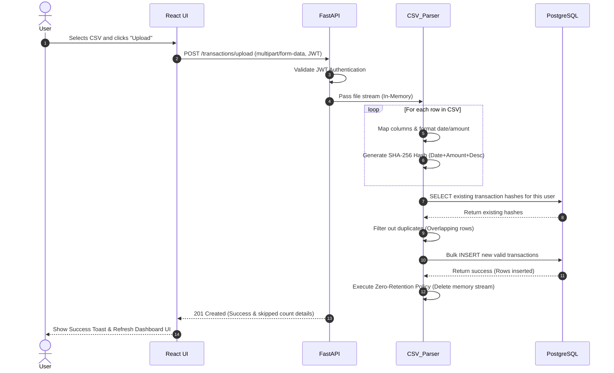
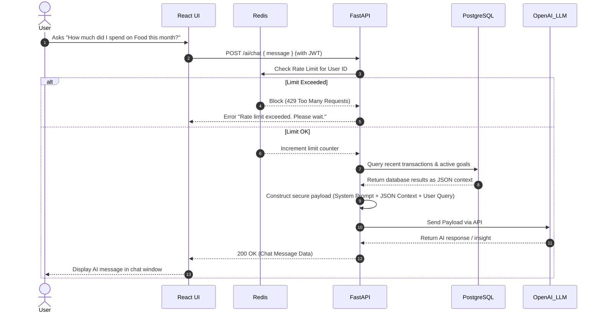

# Phase 13: Sequence Diagrams

This document illustrates the step-by-step logic and communication flow for the two most critical operational sequences in FinPilot AI. These diagrams ensure developers understand exactly how data moves through the system.

## 1. CSV Upload & Ingestion Flow

This sequence demonstrates how a `.csv` file goes from the user's browser, gets parsed, deduplicated via hashes, and saved into the database while strictly adhering to the Zero-Retention policy.

## 2. AI Chat & Secure Context Retrieval Flow

This sequence demonstrates how the AI interacts with the user, fetches financial context securely from the database, checks rate limits, and prevents hallucination by handling logic securely on the backend.

---
**Status:** Phase 13 Completed.
