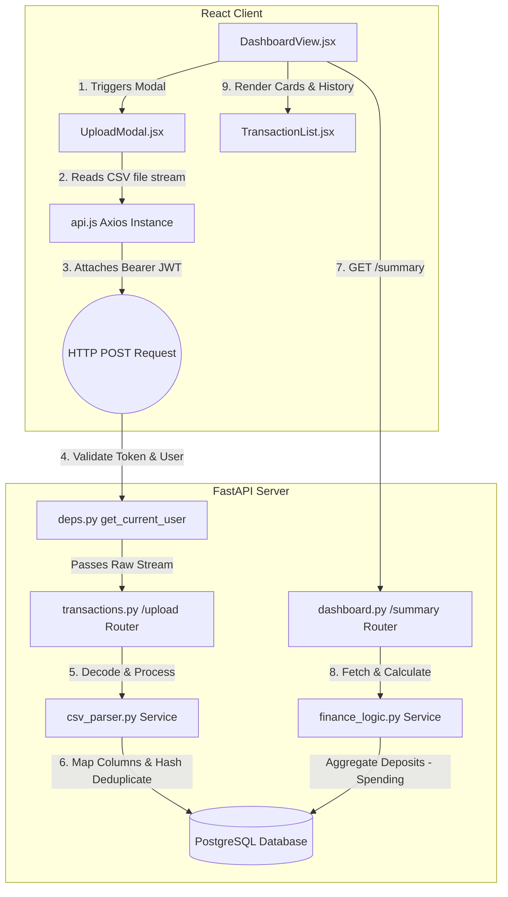

# Sprint 2: Data Ingestion & Dashboard Architecture

This document provides a detailed, step-by-step breakdown of how **Sprint 2 (Data Ingestion & Dashboard)** works, the role of each file, and how data flows through the application.

---

## 1. System Architecture & Data Flow

Below is the complete sequence of how a CSV file is processed, deduplicated, saved, and rendered on your frontend dashboard:

---

## 2. File-by-File Detailed Breakdown

### A. Database Layer
These files define the structure of our database tables. We run Alembic migrations to apply these tables to PostgreSQL.
1. **`backend/app/models/transaction.py`**
   - **Role:** Maps the structure of financial transactions in PostgreSQL.
   - **Key Fields:** Contains standard fields like `amount`, `date`, `description`, `category`, and `type` (`income` or `expense`). Crucially, it stores `transaction_hash`—a unique SHA-256 string generated per transaction.
   - **GDPR compliance:** Links to `User` via a Foreign Key with `ondelete="CASCADE"`. If a user deletes their account, all their financial history is instantly hard-deleted.
2. **`backend/app/models/goal.py`**
   - **Role:** Maps savings goals. This is necessary because goals "lock" a portion of the user's money, directly impacting the "Safe to Spend" calculation.
3. **`backend/app/models/user.py`**
   - **Role:** Updated to include `transactions = relationship("Transaction", ...)` and `goals = relationship("Goal", ...)` to enable easy database querying.

### B. Business Logic Layer (Services)
These files do not interface with the web directly; they contain raw Python business logic to keep the code clean and maintainable.
4. **`backend/app/services/csv_parser.py`**
   - **Role:** The engine that processes uploaded bank statements. It operates strictly in-memory (Zero-Retention Policy).
   - **Column Matching:** Uses a custom *substring matching* algorithm (e.g. mapping `Amount (` or `Amount (INR)` to `amount`, and `Txn Date` to `date`).
   - **Sign Detection:** Detects `Dr/Cr` indicators (`+` for Credit/Income, `-` for Debit/Expense).
   - **Deduplication:** Computes `SHA-256(user_id + date + amount + description + type)` for each row. Before saving, it checks all existing hashes for the user in the database. Duplicate records are skipped, and the remaining ones are saved in a fast *bulk save* operation.
5. **`backend/app/services/finance_logic.py`**
   - **Role:** Performs calculations. 
   - **Formulae:** 
     - `Total Balance` = `Starting Account Balance` + `Sum of Incomes` - `Sum of Expenses`.
     - `Safe to Spend` = `Total Balance` - `Active Goals Total` - `Upcoming Fixed Expenses` (currently stubbed at 0).

### C. Validation Layer (Schemas)
6. **`backend/app/schemas/transaction_schema.py`**
   - **Role:** Pydantic models that act as type definitions for inputs/outputs. It ensures any data entering the backend is correctly formatted.
7. **`backend/app/schemas/dashboard_schema.py`**
   - **Role:** Validates the structure of the dashboard summary stats before they are sent to the client.

### D. Routing Layer (APIs)
8. **`backend/app/api/deps.py`**
   - **Role:** Security dependency module. Decodes the incoming JWT, validates it, and checks against Redis to ensure the session hasn't been revoked (Logout Denylist).
9. **`backend/app/api/v1/transactions.py`**
   - **Role:** Exposes endpoints to `POST /upload` (CSV upload), `GET /` (get transactions table data with optional category filters), and `PUT /{id}` (update category manually).
10. **`backend/app/api/v1/dashboard.py`**
    - **Role:** Exposes `GET /summary` (aggregated numbers) and `POST /opening-balance` (lets the user declare their initial account starting balance).

### E. Frontend UI Layer (React)
11. **`frontend/src/features/transactions/UploadModal.jsx`**
    - **Role:** Drag-and-drop modal UI. Sends the multipart form CSV data to the backend and renders the success details (total rows imported vs skipped duplicates).
12. **`frontend/src/features/transactions/TransactionList.jsx`**
    - **Role:** Table UI. Fetches paginated transactions, styles income in green (`+ ₹`) and expense in white (`- ₹`), and exposes a dropdown menu to change categories.
13. **`frontend/src/features/dashboard/DashboardView.jsx`**
    - **Role:** The main container. Displays metrics cards (Total Balance, Safe to Spend, Goals Locked) and updates them instantly when a starting balance is set or a CSV is uploaded.

---

## 3. Key Technical Edge Cases Solved

- **Flexible Column Matcher:** Prevents upload crashes on custom column headers (like `Txn Date` or `Amount (INR)`).
- **Dr/Cr +/- Indicator:** Correctly converts HDFC/ICICI debit-credit signs into backend expense/income enums.
- **Multitasking CORS Support:** Prevents Axios request blocks when local Vite ports conflict (configured to allow `5173`, `5174`, and `5175`).
- **Python 3.9 Union Types:** Fixed `| None` syntax to use `Optional[str]` for compatibility on macOS environments running older Python interpreters.
- **Bcrypt / Passlib Dependency Conflict:** Pinned `bcrypt==4.0.1` to bypass the deprecated passlib attribute error and 72-byte padding crash.
